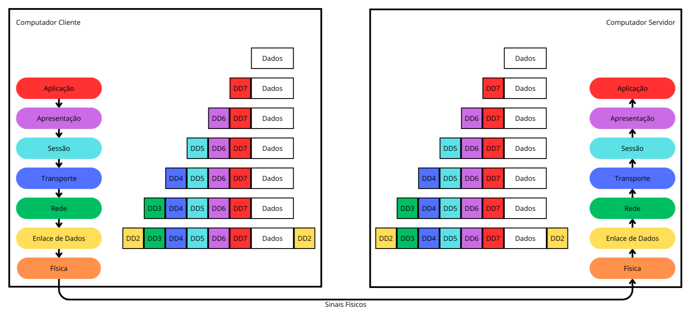
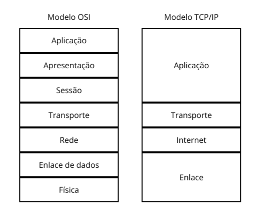

Uma rede de computadores serve para que dois computadores possam se comunicar entre si. Para o caso simples de conectar dois computadores, podemoms ligá-los com um cabo e desenvolver um formato de comunicação própria que permita a troca de dados entre os dois. No entanto, ao adicionar mais computadores temos de arranjar formas mais elaboradas para permitir essa troca de dados. Quando um computador inicia uma comunicação com um segundo para obter um retorno chamamo-o de cliente e ao segundo de servidor, pois o primeiro requisita algum dado e o segundo o serve.

Para que a comunicação entre computadores diferentes (e possivelmente de fabricantes diferentes) ocorra é necessário fazer uso de um formato de dados e um comportamento de envio e recebimento padronizados. Chamamos de protocolo o padrão de formato de dados e comportamento de envio e recebimento destes. Para facilitar o desenvolvimento de protocolos foi proposto um modelo para guiar o desenvolvimento de protocolos de rede.

## Modelo OSI

O modelo OSI é um modelo de sete camadas, em que a função e a relação de cada camada é bem estabelecida, de modo que um protocolo desenvolvido para funcionar em uma camada possa ser facilmente trocado sem afetar as outras camadas. As sete camadas propostas e suas funcionalidades são apresentados a seguir:

* Camada de Aplicação: é a camada mais alta. É responsável por implementar as funções das aplicações. Protocolos nesta camada possibilitam a comunicação entre aplicações em computadores diferentes;
* Camada de Apresentação: é a camada responsável por formatar os dados, por exemplo, lindando com encriptação, codificação e compressão de dados;
* Camada de Sessão: é a camada responsável por estabelecer uma sessão entre a comunicação, lidando com autenticação e autorização, por exemplo;
* Camada de Transporte: é a camada responsável pela transmissão de dados fim a fim, seguindo os requisitos da comunicação, como verificação de erros, erros de transmissão e erros de ordenação dos dados;
* Camada de Rede: é a camada responsável pela seleção da rota que será utilizada pela transmissão dos dados;
* Camada de Ligação de Dados: é a camada responsável pela transmissão dos dados através de uma ligação;
* Camada Física: é a camada mais baixa. É responsável por converter os bytes em sinais físicos e os padrões destes sinais, como voltagem, intensidade, distância máxima de trâsmissão e etc.

É comum se referir à camada de aplicação como camada sete, à camada de apresentação como camada seis e etc. O protocolo da camada sete adiciona dados "ao redor" dos dados da aplicação para uso do protocolo. O protocolo da camada seis adiciona mais dados (se o protocolo for utilizado) e cada protocolo sebsequente. A esse processo damos o nome de encapsulamento de dados. O processo inverso é chamado de desencapsulamento. Ao transmitir dados de um computador para outro, os dados são encapsulados camada a camada, enviados através da rede e desencapsulados no outro computador. Na imagem seguinte podemos ver como ocorre o processo de encapsulamento e desencapsulamento no modelo OSI:

Quando esses dados para utilização do protocolo são adicionados antes dos dados, damos o nome de cabeçalho. Quando esses dados são adicionados após, damos o nome de rodapé.

## Modelo TCP/IP

Com a popularização da internet, dois protocolos em específico ganharam ampla utilização, o TCP da camada de transporte e o IP da camada de rede. Isso deu origem a um modelo mais simples, com apenas quatro camadas. Neste modelo, as camadas de aplicação, apresentação e sessão são mescladas em uma só camada, chamada de Camada de Aplicação, a camada de rede é chamada de camada internet e as camadas de Enlace de Dados e física são mescladas em uma camada chamada de camada de Enlace. Na imagem abaixo podemos ver um comparativo visual entre os modelos:

## Tipos de redes

Redes de computadores podem ser classificadas de acordo com a sua abrangência geográfica, tipo de conexão utilizada e tipos de usuários que têm acesso à rede.

De acordo com a abrangência geográfica podemos classificar a rede como LAN (Local Area Network) ou WAN (Wide Area Network). Uma LAN é uma rede que abrange uma área pequena, geralmente só um prédio e uma WAN é uma rede que abrange uma área extensa, como um país todo. Algumas redes podem ser classificadas como MAN (Metropolitan Area Network), que tem uma abrangência entre a LAN e a WAN.

De acordo com o tipo de conexão utilizada temos as redes de banda larga, que utilizam conexão por meio de cabos de cobre, cabos coaxiais e fibra óptica e as redes móveis e sem fio, que se conectam por tecnologia sem fio (wifi, 5G, 4G, etc).

De acordo com o tipo de usuário que tem acesso à rede, as redes podem ser públicas ou privadas. Redes públicas podem ser acessadas por qualquer pessoa, enquanto redes privadas possuem restrições a quem pode acessá-las (funcionários de uma determinada empresa, militares, governo, etc).

Vários outros critérios podem ser utilizados para classificar uma rede, mas esses são os mais falados entre o público geral.

## Internet

A internet é uma rede pública de alcance global que interconecta várias redes menores por meio de protocolos de rede padronizados. Para que o seu computador tenha acesso à internet é necessário que ele se conecte à rede de um provedor de serviços de internet, ou ISP. O ISP, por sua vez, se conecta a outros ISPs e/ou outras redes de maior abrangência e capacidade. Essas redes também podem oferecer serviços através da rede, como e-mail, mídia, páginas de compra e venda, etc. Desta forma, computadores pessoais conseguem acessar servidores (ou até mesmo ser servidor) através da internet.