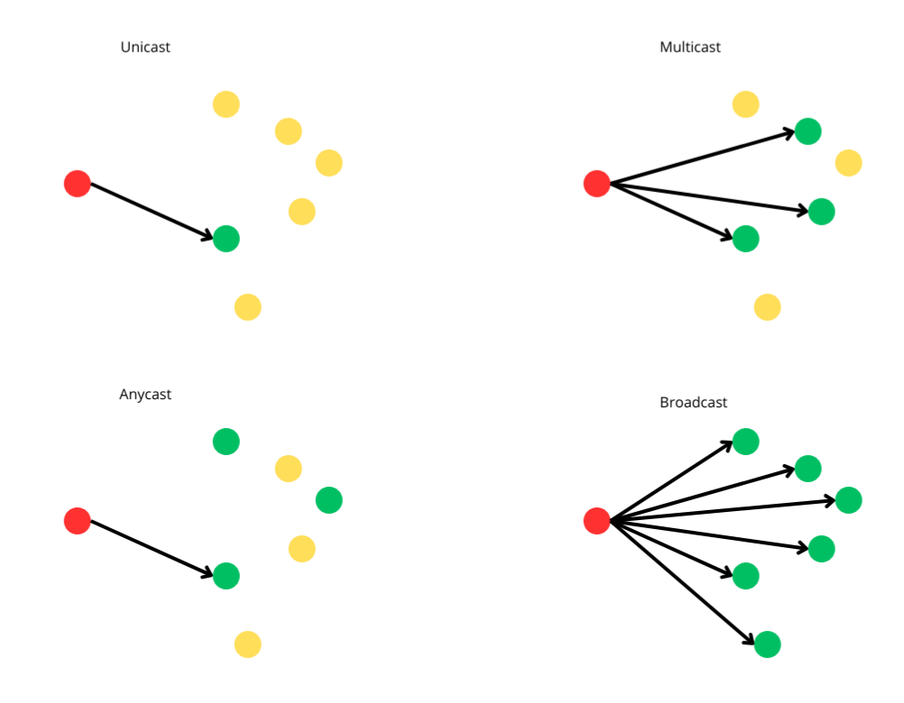

Além dos computadores que geram e recebem os pacotes utilizados na comunicação, uma rede é formada pelos meios por onde os pacotes trafegarão e outros dispositivos que desempenharão vários papeis para que os pacotes cheguem no destino, ou sejam barrados (em caso de pacotes que não devem chegar ao destino). Aos computadores que geram e recebem esses pacotes damos o nome de dispositivos finais e aos outros dispositivos damos o nome de dispositivos intermediários (pois eles intermediam a comunicação).

## Meios de transmissão

Os pacotes utilizam meios físicos para trafegar entre os dispositivos da rede. Cabos de fio de cobre, cabos de fibra de vidro e ondas eletromagnéticas são os meios mais comuns. Quando falamos de rede cabeada, ou com fios, estamos nos referindo às redes que utilizam cabos. Quando falamos de rede wireless, estamos nos referindo às redes que utilizam ondas eletromagnéticas de curto alcance (wi-fi). Às entradas para o conector dos cabos geralmente chamamos de porta.

O padrão Ethernet define características para os cabos e o padrão wi-fi define características para as ondas eletromagnéticas. O padrão ethernet é subdividido nos padrões ethernet, fast ethernet, gigabit ethernet e 10 gigabit ethernet, variando na velocidade. Geralmente são utilizados cabos de par trançado com conectores RJ45, ou cabos de fibra com conectores LC, ou SC.

## Domínio de broadcast

Ao endereçar os pacotes podemos ter um só destino, múltiplos destinos, qualquer destino dentro de um grupo, ou todos os destinos. Damos o nome unicast, multicast, anycast e broadcast a estes endereçamentos, respectivamente. Abaixo podemos ver uma representação gráfica:

O domínio de broadcast é o conjunto de todos os destinos possíveis para um pacote com endereçamento broadcast.

## Dispositivos intermediários

### Hubs, bridges e switches

São dispositivos que conectam vários dispositivos (sejam eles finais ou intermediários) e formam um domínio de broadcast entre eles. Hubs enviam os pacotes com endereçamento unicast para todos os dispositivos conectados, como se fosse endereçamento broadcast. Bridges e switches conseguem enviar um pacote unicast para o dispositivo correto. Bridges eram dispositivos que conectavam duas redes no mesmo domínio de broadcast, mas é comum chamar switches também de bridges. Switches são dispositivos com múltiplas portas.

Switches podem ser gerenciados ou não gerenciados. Switches não gerenciados não permitem configuração, enquanto em switches gerenciados é possível realizar configuração. Switches gerenciados podem ser de camada dois, ou camada três, dependendo das funcionalidades. Switches de camada dois só disponibilizam configurações relacionadas à camada dois do modelo OSI.

### Roteadores

São dispositivos que conectam domínios de broadcast, mas não os agrega em um só. Roteadores permitem que pacotes de uma rede possam chegar em outra. Roteadores decidem a rota que os pacotes farão na rede.

### Firewall, IDS, IPS e WAF

São dispositivos de segurança que inspecionam os pacotes para decidir se eles podem seguir ou não. Podem haver pacotes maliciosos na rede que têm como objetivo fazer um serviço cair, ou permitir uma invasão. Firewalls são dispositivos que podem ser configurados para reconhecer esses pacotes e barrá-los. Um Intrusion Detection System é um sistema que monitora os pacotes e envia alertas quando detecta alguma atividade suspeita. Um IDS pode detectar atividades suspeitas a partir da análise de diversos pacotes. Um Intrusion Prevention System é um sistema capaz de realizar ações quando detecta atividades suspeitas. Um firewall ter um IPS integrado. Neste caso o chamamos de Firewall de Próxima Geração. Também há firewalls capazes de analizar o conteúdo do pacote até a camada sete do modelo OSI. Estes firewalls são chamados de Web Application Firewalls.

### Pontos de acesso

São dispositivos que permitem acesso sem fio para dispositivos finais. Estes dispositivos podem conectar-se à rede por um cabo. Pontos de acesso podem ser configurados como AP raíz, ou AP repetidor. Um AP raíz é o que está conectado diretamente à rede cabeada, enquanto um AP repetidor está conectado a outro AP de modo wireless.

Pontos de acesso podem ser gerenciados de forma centralizada por um controlador.

### PoE

Não é um dispositivo, mas uma tecnologia. Power over Ethernet é uma tecnologia que permite que dispositivos recebam sua alimentação elétrica através do cabo de rede. Desta forma o dispositivo precisará de apenas um cabo para ser instalado e este cabo trafegará dados e alimentação elétrica. Para adicionar alimentação elétrica no cabo, ou o dispositivo provê essa capacidade (um switch que possua portas com PoE, por exemplo), ou pode-se utilizar um equipamento chamado de injetor, que de um lado você conecta o cabo sem alimentação elétrica e a alimentação elétrica e do outro lado o cabo terá dados e alimentação elétrica. Do outro lado o equipamento pode receber diretamente o cabo, ou precisar de um equipamento chamado separador, que vai fazer a separação.

Dispositivos PoE podem ser ativos e passivos. Dispositivos PoE ativos são capazes de negociar a potência da alimentação elétrica, enquanto passivos recebem uma potência definida.