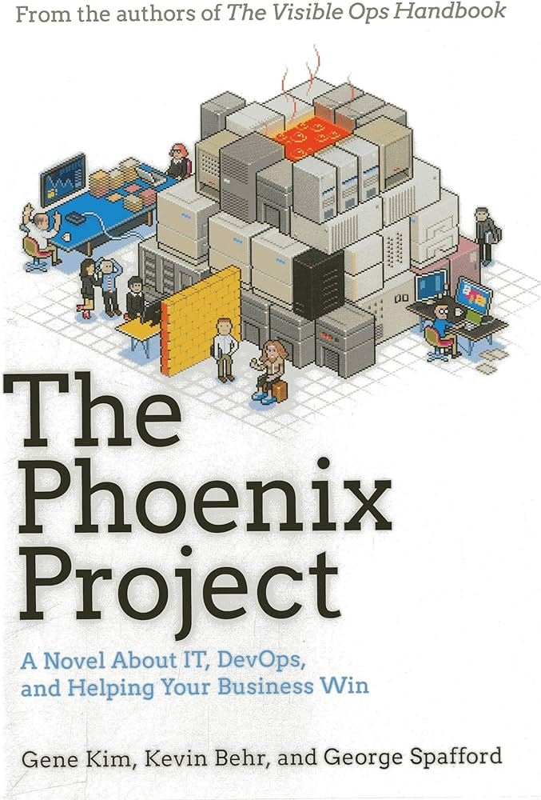
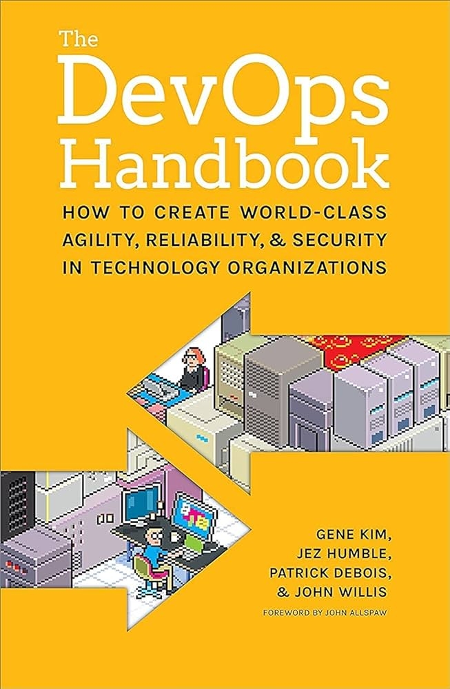
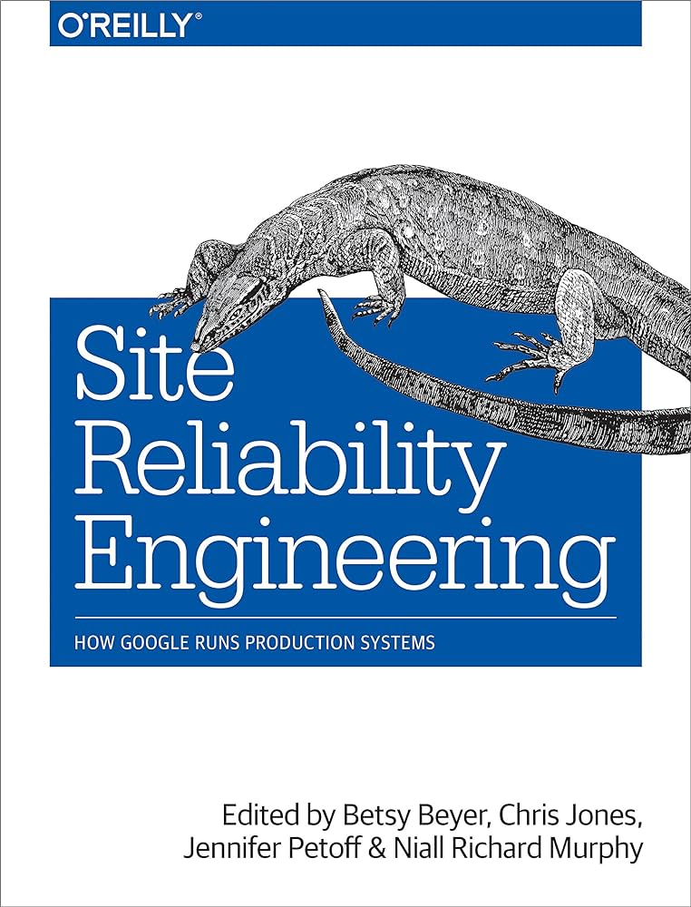

<!-- 
Referências

https://aws.amazon.com/pt/devops/what-is-devops/

https://azure.microsoft.com/pt-br/resources/cloud-computing-dictionary/what-is-devops

https://www.ibm.com/br-pt/topics/devops

https://www.redhat.com/pt-br/topics/devops

https://www.atlassian.com/br/devops

https://www.thoughtworks.com/en-in/insights/blog/getting-devops

 -->

DevOps tem sido um termo muito popular no mundo de tecnologia nos últimos anos. O gráfico abaixo mostra a evolução do número de pesquisas sobre DevOps no google desde 01 de Janeiro de 2022:


 


No grupo do telegram _Novo DevOps BR_ (uma comunidade voltada a tirar dúvidas e discutir sobre DevOps) frequentemente há dúvidas sobre como iniciar na área. Há diversos materiais na internet sobre como iniciar, variando de abordagem e ponto de vista, como [este artigo](https://gomex.me/blog/primeiros_passos_devops/), [esta trilha](https://roadmap.sh/devops?r=devops-beginner) e [esta outra trilha](https://trilha.info/roadmap/devops). Neste texto quero acrescentar o meu ponto de vista sobre como planejar os estudos para iniciar na área.

## O que é DevOps e de onde surgiu?

DevOps é um movimento baseado em uma cultura, processos e ferramentas. Devops não surgiu de um momento para o outro. Por volta de 2007 já eram discutidas ideias sobre como melhorar o processo de entrega de software. É argumentado que a primeira palestra sobre DevOps (ainda não havia o termo) foi feita no evento Velocity de 2009 com o título _10+ Deploys per day: Dev and Ops Cooperation at Flickr_ (10+ deploys por dia: cooperação entre dev e ops na Flickr), por John Allspaw e Paul Hammond. 



No mesmo ano, Patrick Debois organizou o primeiro [DevOpsDays](https://devopsdays.org/) em Ghent, na Bélgica. Cunhando assim o termo DevOps. Em 2013 foi lançado um romance chamado _The Phoenix Project_ (O Projeto Fênix), escrito por Gene Kim, Kevin Behr e George Spafford, narrando como um departamento de TI conseguiu salvar um projeto que estava atrasado e passando do orçamento, corrigindo falhas estruturais na execução do mesmo. Em 2016 é lançado o livro _The DevOps Handbook_ (O Manual de DevOps), que apresenta os tópicos apresentados no projeto fênix de forma técnica.

Além dessa palestra e livros, aconselho também a leitura do livro _Site Reliability Engineering_ (Engenharia de Confiabilidade do Google), que relata como o google gerencia seus sistemas em produção.

## DevOps é cargo?

A resposta sucinta é não. É bem fácil encontrar cargos com o título "engenheiro devops" e "analista devops", e até cargos como "SRE", "platform engineer" e "cloud engineer" com responsabilidades similares. Essas responsabilidades compartilhadas fazem parte dos processos (e ferramentas) de DevOps. Isso mostra que não há um cargo de DevOps, mas cargos que utilizam práticas DevOps.

## O que devo estudar para iniciar em um cargo DevOps?

Um cargo DevOps (não confundir com um cargo _de_ DevOps) herda várias (se não todas) atribuições dos sysadmins, incorporando práticas do desenvolvimento. Deste modo, é primordial que saiba:

* Linux
* Criar scripts (bash ou python)
* Redes
* Construir e executar software
* Serviços auxiliares

Mas, além dos citados acima, também é necessário saber:

* Git
* Contêineres
* CI/CD
* Cloud
* Infraestrutura como código
* Monitoramento

É importante notar que DevOps surgiu junto a várias novidades sobre como executar software, como a massificação do uso de cloud, a criação e popularização de contêineres docker, a publicação dos projetos kubernetes e prometheus como software livre, e essas novidades foram agregadas a DevOps.

### Linux

Linux é um dos sistemas operacionais mais utilizados para executar software como serviço. Saber como executar e gerenciar software é uma habilidade essencial para DevOps. É necessário compreender conceitos básicos sobre sistemas operacionais, como o que são programas, como são executados e o que são processos. Servidores são gerenciados sem interface gráfica, então é necessário aprender como utilizar um terminal efetivamente, desde tarefas simples, como criar arquivos e diretórios, até tarefas mais complexas, como obter informações sobre os processos em execução e sobre o sistema.

### Criar scripts

Um dos pilares dos processos DevOps é automatizar. Logo, é bem mais aconselhado executar uma sequência de passos a partir de um script do que manualmente. Bash é um programa linux que possibilita escrever scripts e executar comandos. Ao utilizar o terminal em linux, provavelmente estará executando comandos no bash. Python também é uma boa opção para escrever scripts.

### Redes

Muito provavelmente você estará trabalhando com um software que é acessado pelos clientes a partir da rede (interna, ou internet), ou tem alguma integração via rede. É importante aprender sobre os conceitos de rede e principais protocolos. Entre os conceitos, busque sobre:

* IP, porta e socket
* Máscara de rede e notação CIDR
* Rotas
* Modelo OSI e TCP/IP

Entre os protocolos, busque sobre:

* IP e DNS
* TCP e UDP
* FTP e NFS
* SSH
* HTTP
* TLS e SSL

### Construir e executar software

Há dois tipos de linguagens de programação, linguagens compiladas e linguagens interpretadas. As linguagens compiladas precisam passar por um processo, chamado de compilação, que transforma o código fonte em arquivos binários que possam ser executados pelo sistema operacional, ou um programa (como é o caso de linguagens para a jvm). As linguagens interpretadas são executadas diretamente por um programa. É necessário, então, saber como levar o código fonte para a execução, onde ele realizará sua função.

O processo (compilação e execução) depende da linguagem utilizada e as vezes até do framework escolhido. É necessário ter em mente que a forma de executar em produção pode ser diferente de como o código é executado durante o desenvolvimento. Por isso, vale buscar a documentação da linguagem e/ou framework para entender como executar o código em produção.

### Serviços auxiliares

Ao executar um software próprio, provavelmente serão necessárias funcionalidades presentes em softwares fornecidos por terceiros, de forma direta ou indireta. Estes softwares de terceiros podem ser bancos de dados, sistemas de fila, proxies, caches, etc. É importante saber a função desses softwares e o quê eles trazem de funcionalidade para o seu ambiente. Por exemplo, procure saber mais sobre os termos seguintes (essa lista não é exaustiva):

* Firewall
* Load Balancer
* Proxy reverso
* Server de caching
* Servidor web
* Servidor de aplicação

### Git

Git é utilizado para gerenciar o versionamento do código. Assim, é importante saber como interagir com um git (e um servidor git) para obter o código que será excutado (ou transformado em um executável). Com algumas práticas DevOps, é necessário produzir código (como scripts, por exemplo), então também pode ser parte do dia a dia interagir diretamente com um repositório git.

### Contêineres

Contêineres docker transformaram completamente a forma de entregar software para a produção. Assim é importante saber criar e utilizar contêineres docker. Além de docker, é necessário saber que existem plataformas para executar contêineres em escala, como o kubernetes. Mesmo estando englobado no tópico de contêineres, é importante salientar que contêineres docker e kubernetes são mundos próprios e tópicos extensos por si só, mas que possuem uma conexão.

### CI/CD

Como dito anteriormente, automatizar é um dos pilares de DevOps. O processo de entrega do software para a produção se beneficia muito de automatização. O tópico CI/CD engloba os termos _Continuous Integration_, _Continuous Delivery_ e _Continuous Deployment_. Cada um destes termos é um passo dentro do processo de entrega do software. Outro termo comum nesse tópico é _pipeline_ (esteira).

### Cloud

Plataformas cloud têm se popularizado nos últimos anos e possibilitado executar software com um investimento menor e escala elástica, e permitindo que o gerenciamento da infraestrutura seja feito a partir de APIs. Muitas empresas menores foram criadas executando software em cloud e várias empresas maiores, que possuem datacenter próprio, também adotam cloud. Mesmo não adotando uma cloud, empresas também podem criar uma cloud interna para facilitar a implantação e gerenciamento do software.

Cloud pode ser um tópico muito extenso. Para iniciar, é necessário entender o seguinte:

* Conceito de cloud (definições, cloud prública e privada, principais clouds públicas)
* Tipos de serviço oferecido (IaaS, PaaS, BDaaS, SaaS, FaaS)
* Tipo de recurso oferecido (computação, rede, armazenamento, segurança, observabilidade, etc)

Então deve-se escolher uma cloud pública, AWS, GCP, Azure, etc, e entender como utilizar os serviços básicos para executar um software. Também pode ser interessante entender sobre serverless.

### Infraestrutura como código

Com a possibilidade de gerenciar a infraestrutura por meio de APIs, surge a possibilidade de utilizar código para gerenciar a infraestrutura. Algumas ferramentas focam em automatizar a configuração de recursos (como programas instalados em um conjunto de máquinas), ou gerenciar os recursos em alguma cloud. As ferramentas mais utilizadas são:

* Ansible
* Terraform
* Pulumi

As clouds públicas também podem fornecer ferramentas de IaC para gerenciar os próprios recursos:

* AWS: CloudFormation e aws cdk
* GCP: Cloud Deployment Manager
* Azure: Resource Manager

### Monitoramento

Ter diversos serviços rodando requer ter visibilidade sobre os problemas que ocorrerem e dados sobre o comportamento dos recursos e softwares. Monitoramento significa coletar dados sobre o ambiente que possam ser analizados e descrevam o estado geral do ambiente. Tradicionalmente são coletados três tipos de dados em um ambiente:

* Logs: Texto produzido por software e anotado pelo momento em que foi produzido. Serve para descrever o que está ocorrendo
* Métricas: Números coletados do ambiente. Serve para expor características quantificáveis do ambiente, como memória consumida, espaço livre em disco, número de requisições, etc
* Traces: Trajetória de uma requisição através de um sistema (possivelmente distribuído). Serve para descrever o que ocorre com uma requisição enquanto é processada

Alguns conteúdos adicionam mais tipos de dados que podem ser coletados, como eventos e exceções.

O importante de saber nesse tópico é como coletar esses dados, armazenar, consultar e transformar em informações importantes sobre o ambiente.

## E segurança?

Assim como ocorre a colaboração dos times de Dev e Ops também podemos colaborar com o time de Sec. No lugar de avaliar a segurança das aplicações e ambientes depois do deploy, e de forma manual, podemos deslocar a segurança para a esquerda e realizar as avaliações por todo o ciclo de entrega de software desde o desenvolvimento. Isso significa utilizar ferramentas que possam avaliar características de segurança de forma automatizada e modelar os riscos de segurança advindos de mudanças no software. Isso não significa remover completamente as avaliações manuais realizadas pelo time de segurança. A este movimento dá-se o nome de DevSecOps.