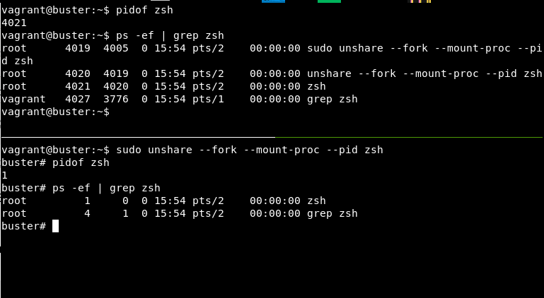

Docker é uma tecnologia que permite realizar o deploy de um software com o ambiente em que ele será executado em uma unidade padronizada. Esta tecnologia evita que ocorram problemas de "na minha máquina funciona", pois o ambiente em que o software está sendo executado é o mesmo, tanto em desenvolvimento, quanto em produção. Esta possibilidade trouxe mais confiança para os deploys.

Máquinas virtuais também permitem realizar a mesma coisa, mas o funcionamento de contêineres docker é completamente diferente do funcionamento de uma máquina virtual. Muitos textos introdutórios falam sobre esta distinção, mas poucos leitores dão a relevância merecida a este tema.

Neste texto buscarei introduzir o que há por baixo dos panos de um contêiner docker e ao final você poderá entender melhor o que difere um contêiner de uma máquina virtual e por que a execução do docker em linux é mais fácil do que em windows.

## A relação do docker com a kernel linux

Docker surgiu em 2013, mas a ideia de ter um ambiente isolado para executar um processo sem recorrer à virtualização vem da década de 80. Antes do docker tivemos estas tecnologias:

- Chroot, 1979
- FreeBSD Jails, 2000
- Linux VServer, 2001
- Meiosys - MetaClusters com Checkpoint/Restore, 2004-2005
- Solaris Containers, 2004
- Linu
- Process Containers, 2006
- AIX WPARs (AIX Workload Partitioning), 2007
- LXC (LinuX Containers), 2008
- Systemd-nspawn, entre 2010 e 2013
- Warden, 2011
- LMCTFY (Let Me Contain That For You), 2013

Mais informações podem ser encontradas [neste post](http://docker-saigon.github.io/post/Docker-Internals/) da comunidade Docker Saigon, [neste artigo](https://blog.aquasec.com/a-brief-history-of-containers-from-1970s-chroot-to-docker-2016) do blog da Aqua Security e [neste artigo](https://medium.com/@oziie/something-missed-history-of-container-technology-e978f202464a) de Ozan Eren no Medium.

Nas primeiras versões docker fazia uso do LXC. Em 2014 a parte que fazia uso do LXC foi substituída por uma biblioteca própria chamada libcontainer. Em 2015 a empresa docker lançou um projeto de padronização do formato de contêineres e entregou uma implementação chamada de runC que faz uso do libcontainer.

LXC, e posteriormente libcontainer, faz a interface do docker com namespaces da kernel, Chroot e CGroups. Namespaces de kernel, Chroot e CGroups são funcionalidades da kernel linux.

## Namespaces de kernel

Namespaces criam abstrações de recursos globais do sistema, como rede e ID de processos, e limitam a visibilidade dos processos dentro do namespace a estas abstrações. Por exemplo, no seu computador você pode visualizar todos os processos que estão executando no momento com o comando `ps -e`. Ao executar um bash dentro de um namespace de PID (ID de processos) e executar o mesmo comando verá apenas dois processos, o do bash e do ps. O ps dentro do namespace não consegue listar os processos que estão fora do namespace. Na imagem abaixo podemos ver este conceito. Na metade de cima podemos ver que o pid do zsh é 4021. Na metade de baixo, que está dentro de um namespace de PID, o mesmo processo tem pid 1.

Existem namespaces para outros recursos do sistema, como pontos de montagem, relógios, ID de usuário e de grupo, etc. Mais detalhes podem ser encontrados no man dos namespaces, [online](https://man7.org/linux/man-pages/man7/namespaces.7.html) ou através do comando `man namespaces` no terminal, ou [neste artigo](https://opensource.com/article/19/10/namespaces-and-containers-linux) do site opensource.com.

O docker faz uso dos namespaces seguintes:

- **pid:** ID de processos;
- **net:** Dispositivos de rede, portas, etc;
- **ipc:** Objetos para comunicação entre processos, como objetos System V IPC e filas de mensagens POSIX;
- **mnt:** Pontos de montagem do sistema;
- **uts:** Hostname e nome de domínio NIS.

## CGroups ou Grupos de Controle

CGroups permitem gerenciar a utilização de recursos da máquina por grupos de processos. Processos são agrupados em CGroups e o CGroup é anexado com parâmetros ou limites de recursos. O implementação dos CGroups visa prover funcionalidades de limitação de recursos, priorização de processos, contabilização do uso de recursos e controle de estado.

Existem diversos componentes que controlam o comportamento de processos em um CGroup. Cada componente destes é chamado de controlador de recursos, subsistema do kernel ou apenas controlador. Os CGroups para um controlador podem formar uma hierarquia, facilitando a gestão dos parâmetros dos CGroups.

Na versão 1 da implementação dos CGroups existe uma hierarquia por controlador e como o desenvolvimento dos controladores não era coordenado, haviam inconsistências e complexidades. Na versão 2 há apenas uma hierarquia e por este motivo há controladores que ainda não são suportados. As hierarquias por controlador da versão 1 ainda podem ser utilizadas por compatibilidade, mas um mesmo controlador não pode existir nas duas hierarquias simultâneamente. Informações sobre CGroups podem ser encontradas no man
 do cgroups, [online](https://man7.org/linux/man-pages/man7/cgroups.7.html) ou offline, e [neste artigo](https://www.linuxjournal.com/content/everything-you-need-know-about-linux-containers-part-i-linux-control-groups-and-process) do site Linux Journal.

A importância da versão 2 do CGroups para o docker, e por extensão para o mundo dos contêineres, é permitir controlar contêineres por usuários que não tenham os privilégios do usuário root. Note que por padrão o daemon do docker executa com usuário root. Mais informações sobre contêineres sem root podem ser encontradas [neste artigo](https://thenewstack.io/linux-cgroups-v2-brings-rootless-containers-superior-memory-management/) da the New Stack e [neste site](https://rootlesscontaine.rs/).

## Sistemas de arquivos Union

Sistemas de arquivos Union, também chamados montagem Union, são tecnologias que permitem combinar múltiplos diretórios em um só. O conteúdo do diretório resultante é a combinação dos conteúdos dos diretórios componentes. Os diretórios são geralmente utilizados em camadas, de forma que o conteúdo de diretórios em camadas mais altas descrevam alterações no conteúdo de diretórios em camadas mais baixas. Quando um mesmo arquivo existe em dois (ou mais) diretórios, o que estiver na camada mais alta é o que aparecerá no diretório resultante. E caso o arquivo seja 'marcado como excluído' em uma camada mais alta, ele não aparecerá. Ao modificar um arquivo em uma montagem union é necessário copiar o arquivo das camadas inferiores e colocá-lo em uma camada superior. Isto é chamado de copy-on-write.

Existem diversos sistemas de arquivo Union, como AUFS, btrfs, vfs e DeviceMapper. Por padrão o docker utiliza o sistema overlayfs (se disponível na kernel o docker utiliza a versão 2 do overlayFS).

Mais informações sobre o funcionamento do sistema de arquivos overlay nas versões 1 e 2 podem ser encontrados [neste artigo](https://docs.docker.com/storage/storagedriver/overlayfs-driver/) da docker e mais informações de como os sistemas de arquivos union são utilizados nas imagens e nos contêineres podem ser encontradas [neste artigo](https://docs.docker.com/storage/storagedriver/), também da docker.

Quando um contêiner é iniciado, o docker cria uma montagem union com as camadas da imagem e um diretório vazio como uma camada superior. As alterações feitas nos diretórios e arquivos do contêiner acontecem neste diretório vazio. Quando o contêiner é removido, este diretório também é removido, assim as alterações feitas no contêiner são perdidas. A vantagem de se utilizar uma montagem union é compartilhando arquivos entre contêineres o uso do espaço total em disco é reduzido.

## Outros componentes e conclusão

O docker também faz uso do programa iptables, um firewall nativo do linux, para conectar os contêineres, e das capabilities da kernel, permitindo a execução de ações por usuários comuns que só o usuário root poderia executar, como fazer uso de uma porta abaixo de 1024. O docker também possui integração com SELinux e AppArmor, sistemas de controle de acesso do linux.

Neste texto podemos vislumbrar o grau de integração do docker com o linux e quais funcionalidades teriam de ser replicadas em outros sistemas para que o docker possa funcionar nativamente.

Outros textos que indico a leitura são [este artigo](https://pasztor.at/blog/under-the-hood-of-docker/) de Janos Pasztor, em que o autor apresenta algumas implementações do uso destas funcionalidades em C, [este artigo](https://blog.4linux.com.br/criando-um-container-do-docker-sem-o-docker/) do Rafael Foschiani na 4linux, em que o autor apresenta um hands-on das tecnologias, e [este artigo](http://docker-saigon.github.io/post/Docker-Internals/) da comunidade Docker Saigon, que apresenta alguns aspectos não presentes neste texto. Indico também [esta palestra](https://www.youtube.com/watch?v=sK5i-N34im8) do Samuel Karp na LinuxFest Northwest 2020 e [esta palestra](https://www.youtube.com/watch?v=sK5i-N34im8) do Jérôme Petazzoni na DockerCON EU 2015.