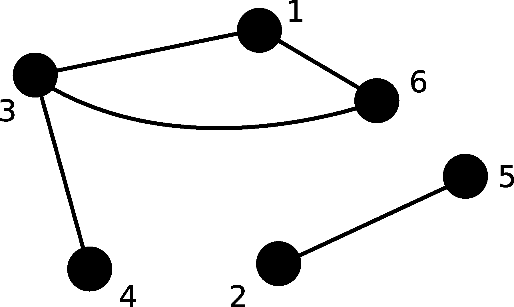

Todo desenvolvedor ou aspirante a desenvolvedor já ouviu falar de SQL (pode ser pronunciado como siquél) e caso você já tenha ouvido, são grandes as chances de já ter ouvido o termo NoSQL (no siquél) também.

Falando de SQL e NoSQL, temos de falar também de sistemas gerenciadores de bancos de dados (SGDB, ou bancos de dados para os íntimos) e então somos inundados com um grande número de softwares com diferentes paradigmas. Neste texto pretendo trazer uma visão geral sobre todo este panorama.

### SQL

SQL ou Structured Query Language (linguagem de consulta estruturada) é uma linguagem para modelar, modificar, guardar e obter dados de um banco de dados relacional baseada no modelo descrito por Edgar Codd em seu artigo ["Um modelo relacional de dados para bases de dados compartilhadas e de grande tamanho"](https://citeseerx.ist.psu.edu/viewdoc/summary?doi=10.1.1.88.646). O SQL é composto pelas sub-linguagens seguintes:
- **DQL (Data Query Language):** Realiza consultas nos dados;
- **DDL (Data Definition Laguage):** Define a estrutura dos elementos no banco de dados;
- **DCL (Data Control Language):** Define acessos aos elementos do banco;
- **DML (Data Manipulation Language):**  Manipula os dados, adicionando, modificando e deletando.

O SQL foi padronizado pela ANSI em 1986 e pela ISO em 1987 e várias revisões foram lançadas, como o SQL-89, SQL-92, SQL:1999, SQL:2003, SQL:2006, SQL:2008, SQL:2011 e SQL:2016. Apesar de ser padronizada, podem existir diferenças entre bancos de dados.

### NoSQL

NoSQL refere-se a todos os bancos de dados não relacionais, distribuídos e horizontalmente escaláveis. O termo NoSQL é atualmente entendido como "not only SQL". Esta abordagem surgiu pela necessidade de trabalhar com grandes volumes de dados e/ou dados de forma variável. Para alcançar estas características estes sistemas permitem com que ocorra consistência eventual dos dados, lembre-se que o [Teorema CAP](https://en.wikipedia.org/wiki/CAP_theorem) não permite que um sistema distribuído seja consistente, disponível e tolerante a partições ao mesmo tempo.

Por abranger um número grande de tecnologias diferentes, geralmente é necessária uma classificação dos tipos de bancos de dados com base em suas características. Neste texto são apresentados seis tipos de banco NoSQL.

### Banco Relacional

Geralmente é dito que bancos relacionais são bancos que permitem relacionar dados de diferentes tabelas, como [aqui](https://aws.amazon.com/pt/relational-database/) e [aqui](https://www.treinaweb.com.br/blog/os-principais-sgbds-relacionais/), mas isto não é a realidade. Bancos de dados relacionais são assim chamados por serem baseados no modelo relacional de Codd, que é um modelo matemático.

Em matemática uma relação é uma tabela em que cada coluna representa um conjunto de dados, por exemplo a tabela:

|  nome  | número |   cor    | animal |
|--------|--------|----------|--------|
| André  |      7 | vermelho | leão   |
| Bruna  |     14 | azul     | águia  |
| Carlos |     12 | branco   | lobo   |
| Débora |      5 | verde    | coruja |

é uma relação (matematicamente falando) em que a primeira coluna é um conjunto de nomes, a segunda coluna é um conjunto de números, a terceira um conjunto de cores e a quarta um conjunto de animais. Em um banco de dados podemos guardar esta relação em uma tabela (mas em um caso real as linhas fariam algum sentido).

Como tabelas são interpretadas como relações, as consultas SQL (DQL em particular) são interpretadas pelo banco como operações sobre estas relações, como criar novas relações a partir de duas relações já existentes (JOIN), retornar apenas alguns conjuntos da relação (SELECT nome, cor FROM) ou subconjuntos dos conjuntos da relação (WHERE).

Bancos de dados relacionais necessitam que seja definido um esquema para os dados. Esquema nada mais é do que a forma dos dados, por exemplo, ao definir uma tabela `clientes` é necessário definir quais colunas há nesta tabela. Esta definição da forma dos dados é feito utilizando a sub-linguagem DDL do SQL.

Bancos relacionais também garantem ser ACID:

- Atomicity: A operação é realizada por completo ou não é realizada;
- Consistency: Os dados devem estar íntegros a todo momento;
- Isolation: Operações concorrentes ou sequenciais devem ter o mesmo resultado final;
- Durability: Finalizada a operação, os dados estarão no mesmo estado mesmo que haja falha do banco.

Exemplos famosos de bancos relacionais são [Oracle](https://www.oracle.com/br/database/), [MySQL](https://www.mysql.com), [Microsoft SQL Server](https://www.microsoft.com/en-us/sql-server/), [PostgreSQL](https://www.postgresql.org/) e [IBM Db2](https://www.ibm.com/analytics/db2).

### Banco orientado a documentos

Bancos de dados orientados a documentos não necessitam que seja definido um esquema para os dados. De acordo com o artigo sobre [document stores](https://db-engines.com/en/article/Document+Stores) da DB-Engines os bancos orientados a documentos podem:

- Ter registros com estruturas heterogênea;
- O tipo de dado de um atributo do registro entre registros pode ser heterogênea;
- Um atributo de um registro pode ter mais de um valor para o mesmo registro;
- Um registro pode ter um documento como atributo.

O exemplo mais famoso deste tipo de banco é o [MongoDB](https://www.mongodb.com/) e os registros podem ser escritos como [JSON](https://www.json.org/json-en.html). Apesar de não necessitar de um esquema, é possível definir um e validar os documentos que serão inseridos.

A grande vantagem de bancos orientados a documentos é permitir trabalhar com dados de formato heterogêneo ou formatos muito complexos.

Além do MongoDB, citado anteriormente, outros bancos orientados a documento são [AWS DynamoDB](https://aws.amazon.com/dynamodb/), [Microsoft Azure Cosmos DB](https://azure.microsoft.com/en-us/services/cosmos-db/), [Couchbase](https://www.couchbase.com/) e [CouchDB](https://couchdb.apache.org/).

### Banco chave-valor

Banco de dados chave-valor funcionam como um Map em java, ou um dictionary em python. Um registro é um par formado por dois valores, um destes é chamado de chave e utilizado para buscar e retornar o valor.

Estes bancos são mais simples que os outros tipos e geralmente executam direto da memória. A sua simplicidade não afeta a sua aplicabilidade, pois bancos chave-valor podem ser utilizados em sistemas embarcados, como uma forma de comunicação entre threads ou processos, estes podendo estar até em máquinas diferentes, e como um cache eficiente.

Exemplos conhecidos de bancos chave-valor são [Redis](https://redis.io), [Memcached](http://www.memcached.org/), [Hazelcast](https://hazelcast.com/), [etcd](https://etcd.io/) e [Ehcache](http://www.ehcache.org/).

### Engines de busca

Engines de busca são soluções otimizadas para busca de dados, seja ela uma busca textual ou busca geográfica. Esta busca pode ser feita de forma estruturada ou não. Uma vantagem destas engines é a liberdade em construir uma busca nos dados.

Exemplos conhecidos de engines de busca são [Elasticsearch](https://www.elastic.co/elasticsearch/), [Splunk](https://www.splunk.com/), [Solr](https://lucene.apache.org/solr/), [MarkLogic](https://www.marklogic.com/) e [Algolia](https://www.algolia.com/).

### Banco wide-column

Bancos wide-column permitem com que colunas sejam adicionadas sem precisar reescrever toda a tabela e com possibilidade de conter registros com um número muito alto de colunas. Bancos wide-column podem ser entendidos como bancos chave-valor com chave bidimensional.

Bancos deste tipo geralmente são utilizados no contexto de big data na escala de terabytes.

Bancos wide-column podem parecer similares a bancos relacionais (afinal o objeto principal destes também é chamado de tabela), mas os registros em um banco wide-column podem ter colunas diferentes entre si e geralmente não possui suporte a join.

Exemplos conhecidos de bancos wide-column são [Cassandra](https://cassandra.apache.org/), [Hbase](http://hbase.apache.org/), [Microsoft Azure Table Storage](https://azure.microsoft.com/en-us/services/storage/tables/), [Accumulo](https://accumulo.apache.org/) e [Google Cloud Bigtable](https://cloud.google.com/bigtable/).

### SGBD em grafos

Grafos são estruturas matemáticas que podem ser representadas por pontos em uma superfície e linhas ligando estes pontos, por exemplo:

Os pontos são chamados de nós e as linhas são chamadas de arestas.

Um SGDB em grafos guarda informações nos nós e arestas em um grafo. Este tipo de banco permite obter informações realizando computações na estrutura do grafo, como descobrir caminho de menor custo, fecho transitivo, etc.

Exemplos conhecidos de SGBD em grafo são [Neo4j](https://neo4j.com/), [JanusGraph](https://janusgraph.org/), [DGraph](https://dgraph.io/), [Giraph](http://giraph.apache.org/) e [TigerGraph](https://www.tigergraph.com/).

### SGBD de séries temporais

Um SGBD de séries temporais é otimizado para dados indexados por um instante de tempo. Este tipo de dado é chamado de série temporal e pode ser utilizada para trabalhar preços de ações no decorrer do tempo, medições de sensores, métricas de infraestrutura, etc.

Enquanto séries temporais possam ser armazenadas em bancos chave-valor, SGBD de séries temporais oferecem mais facilidades ao realizar consulta dos dados e permitindo até realizar 'JOIN' de várias séries temporais em uma só de forma eficiente.

Exemplos conhecidos de SGBD de séries temporais são [InfluxDB](https://www.influxdata.com/products/influxdb-overview/), [Kdb+](https://kx.com/), [Prometheus](https://prometheus.io/), [Graphite](https://github.com/graphite-project/graphite-web) e [RRDtool](https://oss.oetiker.ch/rrdtool/).

### Bancos multi-modelo

Todos estes tipos de banco NoSQL surgiram pela necessidade de armazenamento e busca de dados de forma mais especializada, em contraste com os bancos relacionais que buscam atender esta área de forma mais abrangente. Mas a dificuldade de manter várias soluções diferentes para tratar dados diferentes com linguagem potencialmente diferentes fez com que vários bancos passassem a permitir novas abordagens.

No [ranking de popularidade](https://db-engines.com/en/ranking) do site DB-Engines, 8 entre os 10 bancos mais populares são relatados como multi-modelo, ou seja, permitem múltiplas abordagens para armazenar, modificar e consultar dados. Apesar de serem multi-modelo, estes bancos implementam os outros modelos como extensão de seu modelo principal, como o Oracle que é um banco relacional, mas pode armazenar documentos e dados em formato de grafo como extensão do seu modelo relacional.

Há bancos que já foram desenvolvidos para ser multi-modelo, como o AWS DynamoDB e o Microsoft Azure Cosmos DB.

### Considerações finais

Bancos relacionais ainda podem atender as necessidades das mais diversas aplicações. Bancos NoSQL não vieram para substituir, mas sim para agregar. Conhecer as características destes bancos pode facilitar a forma com que os dados são trabalhados pela sua aplicação e escolher a ferramenta certa pode economizar custo de desenvolvimento e de operacionalização.

O site [DB-Engines](https://db-engines.com/en/) é uma boa fonte de informações sobre o panorama dos SGBDs. Algumas informações sobre bancos NoSQL podem ser obtidas no site da [Hosting data](https://hostingdata.co.uk/nosql-database/). Se deseja ter uma experiência básica de utilização de sete bancos diferentes, aconselho a leitura do livro *Seven Databases in Seven Weeks: A Guide to Modern Databases and the NoSQL Movement* da editora O'Reilly.

