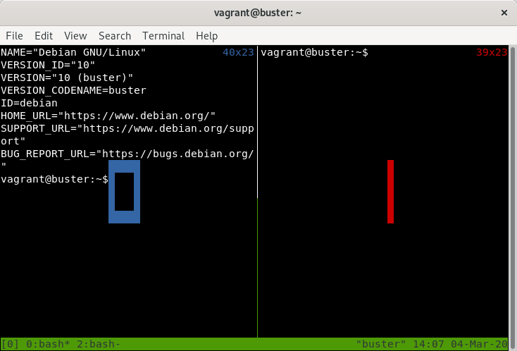
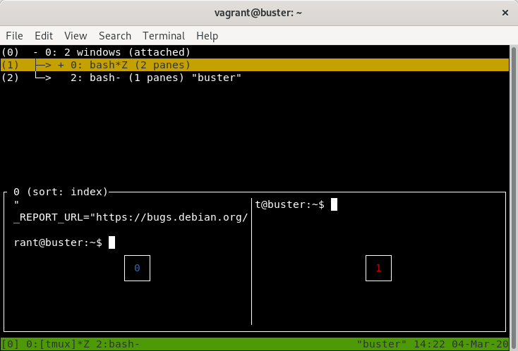

[Tmux](https://github.com/tmux/tmux) é um programa de terminal que permite exibir e executar vários programas de terminal de forma simultânea e gerenciar sessões, permitindo usos avançados do terminal.

Exibir a execução de vários programas simultâneamente é quase um requisito em diversos terminais modernos, como o [Terminator](https://launchpad.net/terminator), [Tilda](http://tilda.sourceforge.net/tildaabout.php), [iTerm2](https://iterm2.com/), [Konsole](http://konsole.kde.org/) e [Terminology](https://www.enlightenment.org/p.php?p=about/terminology), mas com o tmux não é necessário o uso de um terminal específico, possibilitando o uso desta função até em conexões SSH.

Também é possível rodar vários programas simultâneos em uma só sessão, desta forma é possível desconectar e reconectar à sessão sem interromper a execução dos programas. Também é possível que várias pessoas conectem-se a mesma sessão realizando trabalhos simultâneos ou para demonstração da execução de programas.

## Instalação

O tmux pode ser instalado pelo gerenciador de pacotes nas maioria das distribuições. A versão pode variar, como mostra a seguinte tabela:

Distribuição        | Comando               | Versão (Em 03/03/2020)
--------------------|-----------------------|------------------------
Arch Linux 9.2.1    | pacman -S tmux        | 3.0a
CentOS 8 (Core)     | yum install tmux      | 2.7
Debian 10           | apt install tmux      | 2.8
OpenSUSE 20200301   | zypper install tmux   | 3.1-rc
Ubuntu 18.04.4 LTS  | apt install tmux      | 2.6

Caso você queira utilizar a versão mais nova e não use OpenSUSE, ou os repositórios da sua distribuição não têm o tmux, é possível fazer a compilação do código. As bibliotecas [libevent](https://libevent.org/) e [ncurses](https://invisible-island.net/ncurses/ncurses.html) são necessárias na execução e para fazer a compilação são necessários um compilador para C e os programas make e pkg-config, além das dependências de desenvolvimento das bibliotecas libevent e ncurses.

Você pode encontrar mais informações [aqui](https://github.com/tmux/tmux/wiki/Installing).

## Executando

As telas seguintes serão tiradas de uma máquina virtual rodando Debian, portanto versão 2.8 do tmux. Estou rodando a VM pelo [Vagrant](https://www.vagrantup.com/), por este motivo o nome do usuário da máquina.

Ao executar `tmux` no terminal teremos a seguinte tela:

Note que há uma barra de cor verde na parte inferior da tela. Esta barra é chamada de barra de status. A presença da barra de status mostra que o tmux já está sendo executado. Execute um comando qualquer, como `cat /etc/os-release`

Nada diferente do uso normal de um terminal. Agora vamos começar a usar os comandos do tmux. Os comandos devem ser executados após pressionar `<Ctrl-b>` (pressionar a tecla b enquanto segura a tecla Ctrl). Esta combinação é chamada de prefixo.

Execute `<Ctrl-b> + d` (executar o prefixo, soltar a tecla Ctrl e pressionar a tecla d). Este comando desconecta o tmux da sessão.

A sessão ainda permanece ativa e executando os comandos dentro dela. Para ver as sessões ativas execute o comando `tmux list-sessions` no terminal. Assim estaremos enviando o comando `list-sessions` para o tmux.

Para reconectar a esta sessão execute o comando `tmux attach-session`. Veja que a tela é igual ao que era antes de desconectar, mostrando que os programas dentro da sessão ainda continuaram executando.

Execute `<Ctrl-b> + c`. A tela aparentemente foi limpa. Note que a barra de status está diferente. Com o comando anterior criamos uma nova janela no tmux.

Execute `<Ctrl-b> + 0`. Agora retornamos à janela anterior. Por padrão as janelas são numeradas a partir de 0 e podemos acessá-las pelo número, por exemplo, `<Ctrl-b> + 3` vai para a janela de índice 3. Crie mais uma janela e verifique a barra de status.

Cada janela aparece na barra de status no formato `{índice}:{nome}{status}`. Agora é possível ver dois símbolos de status, o símbolo `*` que indica a janela atual e o símbolo `-` que indica a janela ativa anteriormente. Para trocar facilmente para a janela anterior basta executar `<Ctrl-b> + l`. Também podemos nos mover pelas janelas utilizando os comandos `<Ctrl-b> + n` para ir para a próxima janela da lista e `<Ctrl-b> + p` para ir para a anterior.

Vá até a janela 1 e execute `<Ctrl-b> + &`. Este comando remove uma janela. O tmux, por padrão, pede a confirmação ao realizar a remoção.

Vá até a janela 0. No tmux também é possível criar divisões em uma única janela. Execute `<Ctrl-b> + %` e verifique que a janela 0 foi dividida em duas. Cada divisão é chamada de painel. Para fazer a divisão na horizontal execute `<Ctrl-b> + "`

Execute `<Ctrl-b> + q` e você poderá ver o índice de cada painel.

Para mover-se para um painel usando o índice basta executar o comando anterior seguido do índice desejado. Por exemplo, executando `<Ctrl-b> + q + 0` iriamos mover o cursor para o painel da esquerda, o de índice 0. Podemos também usar o prefixo junto às setas do teclado para mover o cursor entre os paineis, por exemplo, `<Ctrl-b> + `&#10145; move o cursor para o painel da direita. A mesma ação pode ser feita com as outras setas do teclado.

Execute `<Ctrl-b> + w`. Este comando permite escolher a janela de forma interativa, inclusive mostrando um preview do conteúdo.

Basta usar as setas do teclado para escolher a janela e ao final usar a tecla `Enter`. Para remover um painel basta executar `<Ctrl-b> + x`. O tmux também pede confirmação.

Ao sair do último painel da última janela o tmux também remove a sessão. Para sair do tmux removendo a sessão sem precisar fechar todas as janelas basta digitar o comando `tmux kill-session` o terminal. Cuidado, pois o tmux não pedirá confirmação para remover a sessão.

