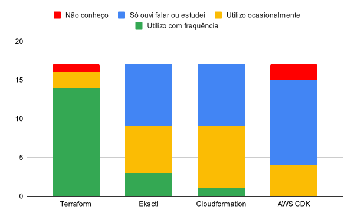

Mais cedo este ano publiquei um [formulário](https://forms.gle/rvvv84Gp8UCAV7AP9) para entender como o EKS estava sendo utilizado por profissionais DevOps, SREs, CLoud Engineers, etc. As perguntas do formulário são baseadas no [Workshop do EKS](https://www.eksworkshop.com/) e na palestra de Henrique Mizael no canal [DevOps Heroes](https://www.youtube.com/live/9QXPbMQrOBM). O objetivo das perguntas desse formulário é saber que técnicas e ferramentas estão sendo empregadas em um ambiente que utilize o EKS.

As perguntas cobrem desde como o cluster é criado até que ferramentas são utilizadas para manter as aplicações no mesmo. As perguntas são divididas em seções. O formulário foi publicado no dia 30 de Maio e no dia 12 de Junho tinha 17 respostas.

# Criação do cluster

Nesta seção buscamos entender quais ferramentas são utilizadas para criar o cluster. Podemos criar o cluster a partir do [console da AWS](https://docs.aws.amazon.com/pt_br/eks/latest/userguide/getting-started-console.html) e através de ferramentas de IaC, como o [Terraform](https://developer.hashicorp.com/terraform), [Pulumi](https://www.pulumi.com/), ou ferramentas de IaC da AWS, como [Cloudformation](https://aws.amazon.com/pt/cloudformation/) e [AWS CDK](https://aws.amazon.com/pt/cdk/). O [eksctl](https://eksctl.io/) é uma cli para criar e gerenciar clusters EKS, tanto através de comandos da cli, quanto por configuração yaml.

Nesta primeira seção há 5 perguntas sobre 4 ferramentas, terraform, cloudformation, AWS CDK e eksctl, uma pergunta para cada e uma última pergunta para coletar outras ferramentas ou métodos além desses 4 citados anteriormente.

De acordo com as respostas, o terraform é utilizado com frequência por 14 pessoas e utilizado ocasionalmente por 2. Só uma pessoa respondeu que não conhece. O cloudformation é utilizado com frequência por uma pessoa e ocasionalmente por 8. 8 Pessoas responderam que só ouviram falar ou estudaram sobre o cloudformation. O AWS CDK é utilizado ocasionalmente por 4 pessoas. 11 pessoas responderam que só ouviram falar ou estudaram e 2 pessoas responderam que não conhecem. O eksctl é utilizado com frequência por 3 pessoas e ocasionalmente por 6. 8 pessoas responderam que só ouviram falar ou estudaram. Outras pessoas também responderam criar o cluster a partir do Rancher, OpenShift, Console da AWS e ansible.

Como podemos ver o terraform é a ferramenta mais utilizada, seguida pelo eksctl e cloudformation. O AWS CDK não é muito utilizado. As respostas são registradas no gráfico abaixo:

# Acesso ao cluster e a serviços da AWS

Aqui buscamos entender quais padrões são utilizados para acessar o cluster e permitir o acesso a serviços da AWS a partir de contêineres no cluster. Os padrões de acesso escolhidos podem impactar na facilidade e segurança da operação do cluster. Podemos configurar o acesso ao cluster com o [Configmap aws-auth](https://docs.aws.amazon.com/pt_br/eks/latest/userguide/auth-configmap.html), a partir de [Entradas de acesso](https://docs.aws.amazon.com/pt_br/eks/latest/userguide/access-entries.html) e a partir de um [Provedor de identidade OIDC](https://docs.aws.amazon.com/pt_br/eks/latest/userguide/authenticate-oidc-identity-provider.html). Podemos dar acesso à AWS diretamente com as credenciais através de [variáveis de ambiente](https://docs.aws.amazon.com/cli/latest/userguide/cli-configure-envvars.html), [arquivos de configuração](https://docs.aws.amazon.com/cli/latest/userguide/cli-configure-files.html), através de [Perfis do IAM para contas de serviço (IRSA)](https://docs.aws.amazon.com/pt_br/eks/latest/userguide/iam-roles-for-service-accounts.html) e através de [identidades para pods](https://docs.aws.amazon.com/pt_br/eks/latest/userguide/pod-identities.html).

Nesta seção há apenas duas perguntas, uma coleta as respostas de acesso ao cluster e a outra coleta as respostas de acesso à AWS.

De acordo com as respostas, 6 pessoas utilizam tanto o configmap aws-auth, quanto as entradas de acesso para acessar o cluster. 5 pessoas utilizam exclusivamente o configmap aws-auth e 6 pessoas utilizam exclusivamente as entradas de acesso.

Para fazer o acesso à AWS 12 pessoas responderam que utilizam os perfis do IAM para contas de serviço, 9 pessoas responderam utilizar identidades para pods, 6 pessoas utilizam variáveis de ambiente com as credenciais, 5 utilizam arquivos populados por volumes do tipo Secret e 2 utilizam arquivos populados pelo secret store CSI driver. Lembrando que múltiplas opções podem ser marcadas nesta pergunta, então foram respondidas diversas combinações de utilização. Das 17 respostas, 15 utilizam IRSA, ou identidades para pods.

De acordo com a seção [Gerenciamento de identidade e acesso](https://docs.aws.amazon.com/pt_br/eks/latest/best-practices/identity-and-access-management.html#_cluster_access_recommendations) do [guia de melhores práticas do EKS](https://docs.aws.amazon.com/pt_br/eks/latest/best-practices/introduction.html) é recomendado utilizar as entradas de acesso no lugar do configmap aws-auth. Uma configuração errada no configmap aws-auth pode bloquear o usuário fora do cluster e o usuário que criou o cluster é o único que consegue acessar o cluster ignorando o configmap aws-auth (isso pode ser uma questão sensível em termos de segurança). Se o acesso ao cluster é feito a partir de uma role e através do configmap aws-auth, o usuário pode não ser registrado corretamente nos logs de auditoria do kubernetes. Por estas e outras questões, é aconselhável utilizar as entradas de acesso.

De acordo com a seção [Práticas recomendadas de segurança do IAM](https://docs.aws.amazon.com/pt_br/IAM/latest/UserGuide/best-practices.html#bp-workloads-use-roles), o acesso à AWS deve ser feito preferencialmente com credenciais temporárias de perfis do IAM. Caso sejam utilizadas credenciais de usuário do IAM, que este usuário só tenha permissão para assumir um perfil do IAM específico. Deste modo, é aconselhado utilizar serviceaccounts e obter as credenciais através de IRSA, ou identidades para pods. Entre estes dois, a AWS recomenda utilizar as identidades para pods, a não ser que haja casos de uso específicos que requeiram IRSA. A tabela seguinte compara os dois:

|   | Identidades para pods | IRSA |
|---|:---:|:---:|
| Requer permissões para criar um provedor de identidade OIDC nas suas contas AWS? | Não | Sim |
| Requer configurar um provedor de identidades por cluster? | Não | Sim |
| Configura tags de sessão relevantes para utilizar com ABAC? | Sim | Não |
| Rquer uma checagem de `iam:PassRole`? | Sim | Não |
| Usa a quota do AWS STS da sua conta AWS? | Não | Sim |
| Pode acessar outras contas AWS? | Indiretamente com encadeamento de perfis | Diretamente com `sts:AssumeRoleWithWebIdentity` |
| Compatível com SDKs AWS? | Sim | Sim |
| Requer o daemonset Pod Identity Agent nos nós? | Sim | Não |

Esta tabela pode ser encontrada na seção [Gerenciamento de identidade e acesso](https://docs.aws.amazon.com/pt_br/eks/latest/best-practices/identity-and-access-management.html#_cluster_access_recommendations) do [guia de melhores práticas do EKS](https://docs.aws.amazon.com/pt_br/eks/latest/best-practices/introduction.html). Mais informações sobre identidade para pods pode ser encontrada nesta [postagem](https://aws.amazon.com/pt/blogs/containers/amazon-eks-pod-identity-a-new-way-for-applications-on-eks-to-obtain-iam-credentials/) do blog da AWS.

# Rede e armazenamento

Aqui buscamos entender quais complementos são adicionados ao cluster para extender as funcionalidades de rede e armazenamento. Para que o kubernetes funcione minimamente é necessária a instalação de um plugin [CNI](https://www.cni.dev/) para a configuração da rede. Para que o cluster consiga utilizar outros tipos de volumes para armazenamento durável, efêmero, ou somente leitura, é necessária a instalação de um plugin [CSI](https://github.com/container-storage-interface/spec/blob/master/spec.md). Além destes, pode ser necessário um controller que provisione balanceadores de cargas para os Services do tipo LoadBalancer.

Nesta seção há 5 perguntas que abrangem vários aspectos sobre redes e sobre armazenamento.

De acordo com as respostas, 16 pessoas utilizam AWS VPC CNI onde 10 destes atualizaram o complemento no cluster. 1 pessoa utiliza o calico. 15 pessoas responderam atualizar o complemento do CoreDNS e 14 atualizam o complemento do kube-proxy.

13 pessoas responderam utilizar o AWS EBS CSI driver atualizado no cluster. 7 pessoas responderam utilizar o AWS EFS CSI driver. 4 pessoas responderam utilizar somente os drivers CSI já presentes no cluster por padrão. 3 pessoas responderam utilizar o mountpoint for S3 CSI driver e o secret store CSI driver.

14 pessoas responderam utilizar o AWS Load Balancer Controller para provisionar balanceadores de carga para serviços LoadBalancer. 3 pessoas responderam utilizar o AWS Cloud Provider, onde apenas 1 destes é atualizado. 7 pessoas também responderam utilizar o AWS Load Balancer Controller como ingress controller. 8 pessoas relataram utilizar o nginx ingress controller e 1 pessoa respondeu utilizar o kong ingress controller e istio gateway.

O AWS VPC CNI é o único plugin oficialmente suportado pelo EKS. Caso queira utilizar um plugin alternativo, é aconselhado obter suporte comercial da empresa responsável. Uma lista de de plugins compatíveis de parceiros da AWS podem ser encontrados [aqui](https://docs.aws.amazon.com/pt_br/eks/latest/userguide/alternate-cni-plugins.html). Vale ressaltar que o AWS VPC CNI também possibilita trabalhar com [IPv6](https://docs.aws.amazon.com/pt_br/eks/latest/userguide/cni-ipv6.html), [implantar pods em sub-redes alternativas](https://docs.aws.amazon.com/pt_br/eks/latest/userguide/cni-custom-network.html) e [atribuir security groups a pods](https://docs.aws.amazon.com/pt_br/eks/latest/userguide/security-groups-for-pods.html).

A AWS possui diversos serviços para armazenamento de dados e são disponibilizados diversos plugins CNI que possibilitem utilizar estes serviços através de volumes.

| Serviço | CSI driver | Provisionamento | Outras funcionalidades |
| --- | --- | --- | --- |
| EBS | [AWS EBS CSI Driver](https://github.com/kubernetes-sigs/aws-ebs-csi-driver/) | Estático e dinâmico | Snapshot, Volumes em bloco, redimensionamento e modificação de volume |
| EFS | [AWS EFS CSI Driver](https://github.com/kubernetes-sigs/aws-efs-csi-driver) | Estático e dinâmico | Encriptação de dados em trânsito, montagem entre contas, driver multiarch |
| FSx para lustre | [AWS FSx for Lustre CSI Driver](https://github.com/kubernetes-sigs/aws-fsx-csi-driver) | Estático e dinâmico |
| FSx para OpenZFS | [AWS FSx for OpenZFS CSI Driver](https://github.com/kubernetes-sigs/aws-fsx-openzfs-csi-driver) | Estático e dinâmico | Snapshot e redimensionamento |
| FSx para NetApp ONTAP | [Trident](https://docs.netapp.com/us-en/trident/trident-use/trident-fsx.html) | Estático |
| File cache | [AWS File Cache CSI Driver](https://github.com/kubernetes-sigs/aws-file-cache-csi-driver) | Estático e dinâmico |
| S3 | [Mountpoint for S3 CSI Driver](https://github.com/awslabs/mountpoint-s3-csi-driver) | Estático |

O [AWS Load Balancer Controller](https://kubernetes-sigs.github.io/aws-load-balancer-controller/latest/) permite provisionar e gerenciar Elastic Load Balancers do tipo Network para Services do tipo LoadBalancer e do tipo Application para Ingress.

# Escalabilidade

Nesta seção buscamos entender que complementos estão presentes no cluster para realizar a escala de Deployments, Statefulsets, nós, etc. Pode ser necessário escalar o número de nós automaticamente de acordo com o número de pods atualmente em execução. Para este fim temos o [Kubernetes Cluster Autoscaler](https://github.com/kubernetes/autoscaler/tree/master/cluster-autoscaler) e o [Karpenter](https://karpenter.sh/). Para escalar o número de pods temos o [Horizontal Pod Autoscaler](https://kubernetes.io/docs/tasks/run-application/horizontal-pod-autoscale/) nativo no kubernetes e o [Keda](https://keda.sh/).

Nesta seção há apenas duas perguntas, uma sobre a escala de nós e a outra sobre a escala de pods.

De acordo com as respostas, 10 pessoas utilizam o Karpenter para fazer a escala de nós, 6 utilizam o Kubernetes Cluster Autoscaler e 1 pessoa utiliza Auto Scaling Groups da própria AWS. 13 Pessoas responderam utilizar o Horizontal Pod Autoscaler para fazer a escala de pods e 8 pessoas responderam utilizar o Keda.

O Kubernetes Cluster Autoscaler altera o número de máquinas nos Auto Scaling Groups dos Node Groups do cluster, enquanto o Karpenter utiliza a API de EC2 diretamente.

O Horizontal Pod Autoscaler já é nativo do kubernetes. Para que ele funcione, só é necessário ter o metrics server instalado no cluster. O keda é um complemento do cluster. O HPA lida melhor com métricas de utilização, enquanto o keda lida melhor com métricas de eventos. O keda também pode ser utilizado com métricas de utilização.

# Observabilidade

# Outras ferramentas